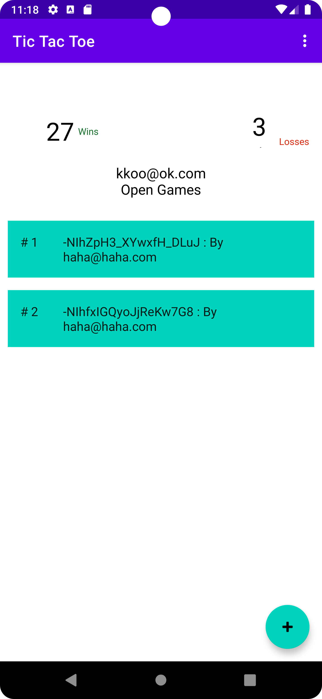

# README - Assignment 5

Name: **Rajath V**

ID: **2019A7PS0122G**

Email: **f20190122@goa.bits-pilani.ac.in**

---

## A Brief Description:

TicTacToe is a realtime one player/two player game that basically simulates the standard tic tac toe game and keeps track of the number of times a user has won and lost by storing it all in Firebase.

## Known Bugs:

- The app is slow to load game data from firebase.
- The back button when pressed from dashboard fragment does not do anything, because on the stack it wouldve taken the user to the login fragment but the user is already logged in so that is redirected back to the dashboard fragment.

---

## Screenshots:

[Two player non host]

[Host two player]

## Description of the Tasks

---
**Hosting the application**

- To host the application, we would have to setup the android firebase application instance on the backend along with the real time database and authentication.
- All of this is already done on the application so the app is basically usable as is.
- One can install it directly and run without the need to configure any backend services manually.

**Task 1:**

- Sign in was implemented by using FirebaseAuth instance.
- This provides two methods, `createAccountWithEmailAndPassword` and `signInWithEmailAndPassword`
- After setting up auth in firebase console, we check if the user exists with the credentials and accordingly sign up or sign in.
- The dashboard shows the wins, losses and open games, where each open game is in a recycler view list which shows the game id and the user who created it.
- There is a floatingActionButton that shows a dialog to create a one player game or a two player game.
- A one player game is played between the computer and the user while a two player game uses the realtime database to actually add another user.

**Task 2:**

- The single player mode plays the user against the computer.
- The user has their turn to click and the user by default is “X”. The computer then picks up a random box out of the remaining ones and marks it with an “O”. If there are no blocks remaining, we decide that it is a draw and appropriately show a dialog box and return.
- If the user wins, a dialog shows the win message and then the user’s score gets updated in real time in the database in Firebase.
- Similarly if the user loses, then their score is automatically incremented in the loss count and this is reflected in real time.
- All of this leads the user back to the dashboard which shows the available new scores.

**Task 3:**

- To enable live game play, a real time database was used from firebase.
- This meant that there were listeners used to check for live data changes and accordingly data on the application was updated.
- Clicking logic was the same for the game as the single player logic, but there were certain caveats in the way the players joined the game.
- A listener was needed to check for when a user joined an ongoing game, and also listeners to check for when data was being changed on the database.
- Checks for win, loss and draw were done very much in the same manner as before.,
- The major chunk of work was in setting up how the model must behave and when do updates to the database happen.
- To enable easy addition into the database, I created two models for `player` and `game` respectively.
- Both those endpoints were also present in the database which in essence stored Player and Game objects respectively.

**Task 4:**

`TaskNotFoundException(): There is no task 4 in the assignment document` 

### 

---

## Testing

- I only used the monkey testing tool with this assignment this time.
- The way to do this is by running `adb shell monkey -p androidsamples.java.tictactoe -v n`
- Where n is the number of iterations.
- I ran this on a friend’s physical device for 2000 iterations and 5000, the app did not crash on any run.
- A single navigation testing instrumented test is written but it needs a special case to start the application in a particular manner along with a timeout to work.

## Accessibility checks

- Mainly two accessibility checks were performed, one being the main accessibility check from the instrumented tests and the other being the scanner.
- Scanner showed issues with text contrast in the button and it was resolved.

---

## Time taken to complete the assignment

The assignment took approximately 25 hours to complete, with coding and understanding the testing taking up a good chunk ~22 hours of time, and the rest being documentation (README and final touches).

---

## Difficulty rating

The assignment was the most difficult one yet. I would rate it a 9.5/10 in terms of difficulty.

---

## Sources:

- [https://firebase.google.com/docs/database/android/read-and-write](https://firebase.google.com/docs/database/android/read-and-write)
- [https://console.firebase.google.com/u/1/project/tictactoe-644fe/database/tictactoe-644fe-default-rtdb/data/~2F](https://console.firebase.google.com/u/1/project/tictactoe-644fe/database/tictactoe-644fe-default-rtdb/data/~2F)
- [https://stackoverflow.com/questions/68910946/how-to-check-if-the-particular-username-exists-in-the-firebase-java-android](https://stackoverflow.com/questions/68910946/how-to-check-if-the-particular-username-exists-in-the-firebase-java-android)
- Many many stackoverflow articles on firebase and event handling
- Manthan Asher (f20190144) for providing a physical device for checking correctness of two player.